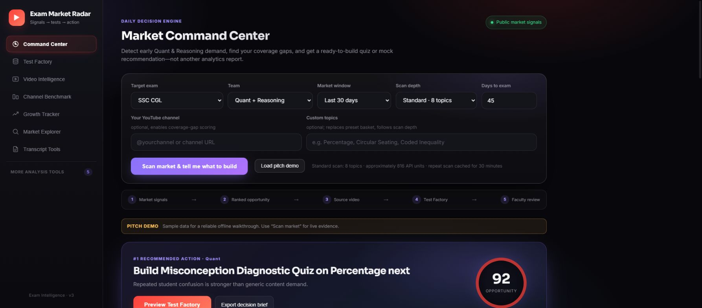

# Exam Market Radar & Test Factory

Turn scattered YouTube signals into a prioritized assessment-production queue.

**Built by Himanshu Chauhan** · [GitHub](https://github.com/himanshuc2406) · Contact: himanshuc2406@gmail.com

## Project walkthrough




## What the code implements

- Rank Quant and Reasoning topics using age-normalized views, student doubts, practice requests, competitor coverage and existing inventory.
- Choose quota-conscious scan depth and reuse recent scans through a 30-minute cache.
- Move source videos into a transcript-based test-drafting workflow, with deduplication and faculty review.
- Export the review bank to editable Excel and paginated PDF.

## Technical stack

Python · Flask · JavaScript · SQLite · YouTube Data API · Gemini · OpenPyXL · ReportLab

## Run locally

```bash
python -m venv .venv
# Activate .venv for your operating system.
pip install -r requirements.txt
python app.py
```

Open **http://127.0.0.1:5002**. Never commit your `.env`, API keys, OAuth credentials or runtime databases. Blank configuration examples are provided where needed.

## Verification

23 existing unit and endpoint tests passed in the cleaned copy. These cover ranking, caching, draft status, doubt filtering and exports. Live API/model generation was not exercised.

## Scope and limitations

Screenshots show the built-in offline pitch demo, clearly labeled as sample data. Directional scores are not search-volume estimates. The review bank resets when the page reloads; export before refreshing.

## Repository structure

- `.env.example`
- `.gitignore`
- `app.py`
- `core /`
- `data /`
- `docs /`
- `INFOGRAPHIC_SECTION_dropin.md`
- `MASTER_PROMPT_Notebook_and_Quiz_Generator.md`
- `README.md`
- `requirements.txt`
- `run.bat`
- `run_mac.command`
- `static /`
- `templates /`
- `tests /`
